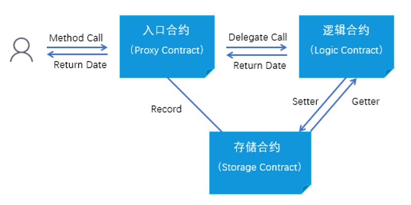
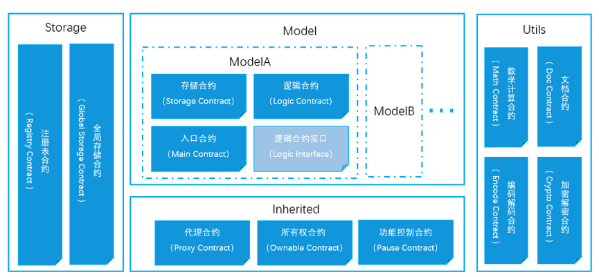

### 可升级的智能合约设计模式

## 智能合约的现状

　　以太坊在区块链上实现了智能合约的概念，用于：同质化通证发行（ERC-20）、众筹、投票、存证取证等等，共同点是：合约逻辑简单，只是业务流程中的关键节点，而非整个业务流程。而智能合约想解决的信任传递，是环环相扣的，如果在传统系统环节被恶意侵入和篡改数据，那么传入智能合约的数据就是不受到信任的。因此，整体业务流程上链是智能合约发展的趋势。

　　

## 智能合约的局限

　　智能合约在早期被设计的时候，并不打算支撑复杂的业务体系，这和它设计的初衷相违背：漏洞往往出现在程序员编写的代码和他想实现的逻辑之间存在着差距，越是简单的代码越是安全。简单和受限访问成了智能合约安全可靠的保障。

　　因此，智能合约引入了隔离网络和文件系统的沙箱环境、基于栈的编译器（有限高度的栈深以及仅可访问栈顶16个元素的限制）、静态语言、gasLimit（限定了合约的大小，每个合约能处理的逻辑有限；限定每个函数逻辑的复杂度，每一步操作都会消耗gas，以至于连使用循环都成了奢侈）、严格的内存访问限制（每个合约仅可以访问自己的存储单元），这就导致了智能合约不同于传统编程语言，自身就带着诸多限制。

　　目前，智能合约仍然处于发展的早期阶段，配套的工具、成熟的框架、第三方包寥寥可数。因此编写复杂业务场景的智能合约，只能从底层的逻辑开始编写：编写数据库模型CURD、跨合约数据交互、增强基本数据类型功能（string类型的slice、array的delete），导致开发合约速度的缓慢。

　　另外，由于区块链的另外一个特性：防篡改。这导致了智能合约部署上链后，任何人包括合约所有者都不能再进行修改。意味着智能合约无法像传统应用那样实现敏捷开发，合约的每一个方法都需要进过大量测试，保证整个合约的正确性严谨性。即使保证合约不出问题，但业务的需求并非一成不变，业务变动，智能合约无可避免的跟着变动，那么意味着合约的重新部署，但是旧合约的数据是无法转移到新合约上的；已部署好的合约如果存在漏洞被恶意攻击，需要有方法能够尽快停止合约运行，保证用户数据不被篡改，留出时间让智能合约的编写者快速修复漏洞。因此，合约的升级和管理需要设计。

　　

## 智能合约目前的发展方向

　　编写智能合约的程序员目前分为两派，一派主张合约尽可能的精简，只有简单才不容易出现错误，只有关键部分上链部分；另一派主张信任传递的闭环，也就是说整个业务逻辑尽可能多的上链，例如Polymath，ConsenSys，它们将完整的业务流程利用智能合约的方式实现。

　　轻量级的智能合约并没有太多的技术难点可讲，真正需要发展的是智能合约设计模式。

　　目前，已有的官方推荐的工具集， Zeppelin，它提供了：

   * 数学计算
   * 合约所有权
   * 编码解码
   * 加密解密

　　方便合约编写者调用，但这些只能是以工具、参考的形式存在，并不能算作真正意义上的设计模式。目前Zeppelin社区也在积极探索智能合约设计模式的实现方式。

　　Zeppelin社区目前构思了智能合约与逻辑分离的设计模式，用于解决智能合约升级的问题。

　　参考：[代理合约设计模式](https://blog.openzeppelin.com/proxy-libraries-in-solidity-79fbe4b970fd/ "代理合约设计模式")

 

　　

## 如何利用智能合约实现复杂的业务场景

　　目前受限于智能合约的限制，只能实现业务场景中的关键步骤，如果将整个业务放到链上执行，传统智能合约的编写方式将不再适用，例如无法解决合约文件大小的瓶颈、参数过多导致栈深错误、合约之间互相访问存储数据的问题等等，这些都会影响智能合约的编写。目前如何编写能够承载负责业务场景的智能合约，已经成为行业共同面临的挑战之一。

　　在这里，我参照传统MVC设计模式、基于关系型数据库存储，结合智能合约自身特性，Zeppelin社区提供的合约分离理念，初步实现复杂业务场景的智能合约设计模式。

　　**一、针对业务功能处理**

　　每个业务场景包括多个角色，角色既有单独操作，也有与其他角色共同配合的操作。

　　针对角色，将其合约拆分成为：入口合约、存储合约、逻辑合约。

　　1） 设计存储合约，用于存储角色模型的数据，并提供对外访问的CURD方法，实现效果等同于MVC中的Model层。

　　2） 设计逻辑实现合约，利用存储合约提供的CURD，实现业务逻辑。类比于MVC中的Controller层。

　　3） 设计入口合约，用于提供对外访问的地址，将用户的请求转发至逻辑合约进行处理，执行的结果存入存储合约中。
  

　　**二、针对业务变动及风险处理**

　　考虑到业务会发生变动。将传统智能合约拆分成：入口合约、存储合约、逻辑合约，三个合约各司其职，共同实现业务，当业务发生变动需要修改，修改并重新部署逻辑合约，并将新版本的逻辑合约注册到入口合约，即可以解决

　　1、 合约可实现性：突破合约大小限制、函数复杂度限制

　　2、 合约可升级性：地址不变，只对合约功能进行升级

　　3、 合约可维护性：发现bug时，及时对合约进行修复

　　另外，智能合约继承自功能开关合约，可以实现当智能合约发现漏洞时，紧急关闭某些功能（例如转账），减少损失。
  

　　**三、针对业务角色之间的交互处理**

　　智能合约中，数据的记录都是Key-Value形式，类似于Redis这样的数据库，数据之间的关联较弱。通过设置各个合约都可以访问的全局存储合约，记录各个入口合约的地址、合约数据之间的关联关系，使各个合约之间可以数据互通。

　　**四、针对业务场景中的执行权限处理**

　　智能合约继承自所有权合约，可以限制合约中某些关键方法的操作者，这些操作者可以是个人账户、也可以是合约账户，使合约受控于系统管理员。另外，也提供了权限转移功能，可以方便的将权限转移给其他管理员。

 

　　

 

## 智能合约设计模式的技术点
　　**1.  委托调用**

　　以上智能合约的拆分，就是依赖智能合约中委托调用的特性。

　　委托调用，会保留调用者的账户与信息，例如User调用合约A中funcA，funcA委托调用合约B中的funcB，那么funcB的调用者就是User，而不是合约A。委托调用的优势就是可以保留调用合约的上下文，只是利用合约B的代码实现想要的功能。这样可以：

* 减少合约A中的代码量。
* 合约B中的逻辑可以随时更新。
 
 

　　**2.  Fallback机制**

　　当调用智能合约中未定义的方法时，智能合约会将调用者及参数都传给一个错误处理函数，类似访问了网站中不存在的页面，会跳转到404页面一样。正是利用了这个特性，合约A（上文例子）将在这个fallback函数中统一处理这个未定义方法。

 
 

　　**3.  内联汇编**

　　智能合约中的委托调用，只会返回调用结果是True和False，但我们要达成智能合约的拆分，就要让委托调用返回调用后的结果，这就需要修改委托调用的指令集，将结果返回。通过内联汇编，修改智能合约中委托调用的实现。

 
 

　　**4.  全局存储合约**

　　全局存储合约是模拟传统key-value数据库，通过智能合约的方式实现数据库的CURD，将系统的配置（比如管理员的地址、Token与稳定货币的兑换比例等）、各个模块入口合约的地址、合约之间的关联关系存储起来，打通各个合约之间的数据。

 
 

　　**5.  合约的合理拆分**

　　目前将合约拆分为入口合约、存储合约、逻辑合约。

* 入口合约：所有与合约的交互都是通过入口合约。入口合约记录了存储合约地址：通过委托调用转发给逻辑合约处理，修改存储合约数据。记录了逻辑合约的地址和版本：知道该转发给哪个版本的逻辑合约处理。

* 存储合约：负责存储数据，合约的存储结构不能变，这是底线。类比数据库中的表，一旦设定就不能轻易修改；访问及修改数据的接口，其他合约不能直接访问当前合约的数据，需要通过外部函数来访问和修改，例如java model中的setter和getter 方法，实现存储合约的的CURD。

* 逻辑合约：负责处理合约逻辑，通过组合存储合约的CURD，实现复杂的逻辑。

 

　　

 

## 智能合约设计模式
**模块设计模式**

   

　　1、 用户调用入口合约函数。

　　2、 入口合约委托给逻辑合约处理。

　　3、 逻辑合约进入到入口合约上下文，获取到存储合约地址，修改/查询存储合约数据。

　　4、 逻辑合约返回数据给入口合约。

　　5、 入口合约返回数据给用户。

 

**整体框架设计模式**

　　

 

## 智能合约设计模式的优缺点
**优点：**

　　a) 拆分智能合约，可以绕过合约大小的限制，实现复杂的功能。

　　b) 可以通过升级逻辑合约来更新智能合约。

　　c) 可控的智能合约，当出现问题时，管理员账户可以关闭关键性操作。

　　d) 将功能性合约封装成通用合约，减少重复部署合约消耗的gas。

　　e) 通用全局存储，可以满足任意格式数据的存储与读取。

　　f) 合约注册表，可以方便合约之间的互相调用。

**缺点：**

　　a) 拆分智能合约，合约总体代码量增加，增加了部署时gas的消耗。

　　b) 合约的可读性大幅下降，用户无法简单的读取合约的逻辑。

　　c) 键值对的存储合约操作复杂。

 

　　

 

 

## 可升级智能合约DEMO

　　当前DEMO实现了客户注册，通过管理员审核后，实名转账获得ERC-20代币的业务场景。**注意，当前DEMO只是为了阐述可升级的智能合约设计模式，不保证不存在漏洞。**
    
　　合约框架结构

    - contract
       |-- account                          // 客户模块，包含入口合约、逻辑合约、存储合约
           |--  Account.sol                 // 客户入口合约
           |--  AccountDelegate.sol         // 客户逻辑合约
           |--  AccountStorage.sol          // 客户存储合约
           |--  IAccountDelegate.sol        // 客户逻辑合约接口
           |--  StorageStateful.sol         // 公共存储地址
       |-- common                           // 公共合约
           |--  Proxy.sol                   // 代理合约 
           |--  KeyValueStorage.sol         // 全局存储合约
       |-- interface                        // 公共接口
           |--  IOwnable.sol                // 所有权接口 
       |-- libraries                        // 库合约
           |--  Util.sol                    // 工具库
       |-- test                             // 测试
           |--  AccountTestDelegate.sol     // 客户合约测试
       |-- token                            // 代币
           |--  erc20.sol                   // erc20
       |-- zeppelin-solidity/contracts      // 第三方合约      
       
　　**部署**
    
　　使用Remixd将contract映射到Remix编辑器中，然后部署

　　1）KeyValueStorage.sol
    
　　部署账户地址将作为系统管理员地址。 然后再通过系统管理员账户部署客户入口合约
    
　　2）Account.sol
    
　　部署成功后，系统管理员账户部署客户逻辑合约
    
　　3）AccountDelegate.sol
    
　　部署成功后，管理员身份调用Account.sol的initialize()方法，传入KeyValueStorage.sol合约地址，AcconutDelegate.sol合约地址作为参数，Account模块部署完成，然后部署
    
　　4）AccountTestDelegate.sol
    
　　供后续测试使用。最后任意账户部署erc20.sol，初始化时，除了传入token信息外，还需要传入KeyValueStorage.sol合约地址作为参数。
    
　　部署完成，顺序如下图。
    
　　

　　**测试**

　　一、注册客户
    
　　利用之前部署好的AccountTestDelegate.sol注册客户。首先，先调用setAc()方法传入Account.sol合约地址。如下图。

　　

　　再调用rgister()方法注册客户，调用search()方法查询刚注册的客户。如下图
    
　　

　　注册成功。

　　二、转移Token
    
　　利用erc20.sol的transfer()方法转移Token，传入刚刚注册的客户名，转移Token数量作为参数。提示当前客户未通过认证。如下图。
    
　　    

　　利用合约进行测试时，msg.sender为当前合约地址，如想完整测试转移token功能，请利用web3j连接合约进行测试。
    
　　三、升级合约
    
　　通过升级逻辑合约AccountDelegate.sol来升级客户合约的功能。首先，部署新的逻辑合约AccountDelegate.sol。部署成功后，在Account.sol合约中，利用upgradeTo()方法，传入版本号、新的逻辑合约地址作为参数来升级合约可实现的功能。如下图。
    
　　    
 

    
    